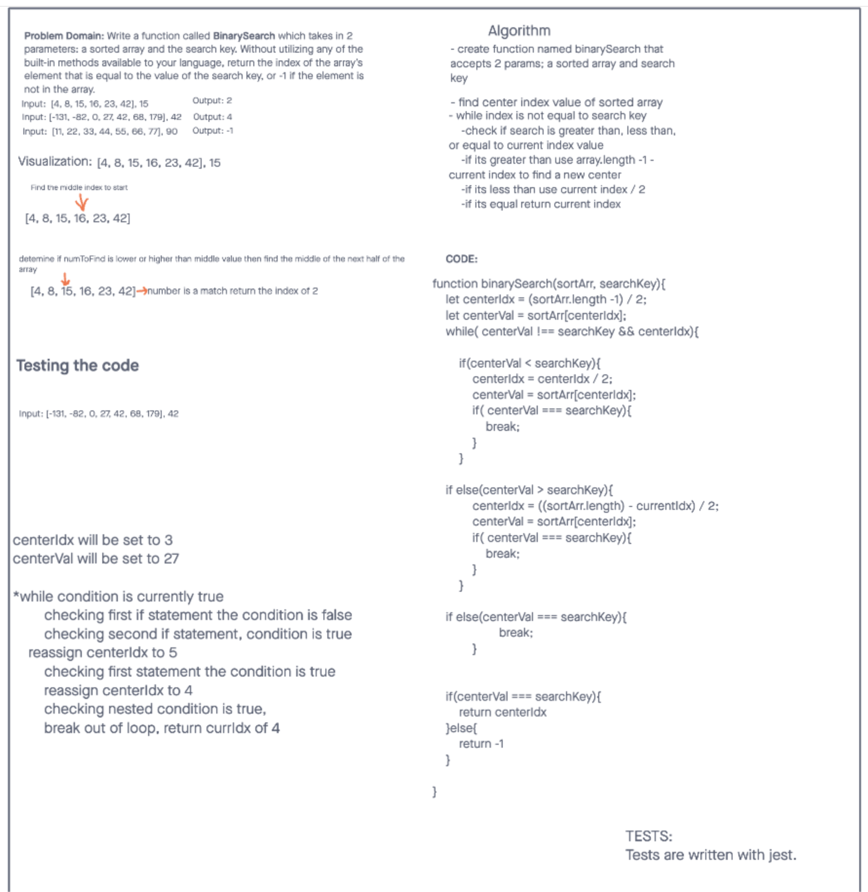

# Insert to Middle of an Array
Write a function called BinarySearch which takes in 2 parameters: a sorted array and the search key. Without utilizing any of the built-in methods available to your language, return the index of the array’s element that is equal to the value of the search key, or -1 if the element is not in the array.

## Whiteboard Process

## Approach & Efficiency
We declared a value for the center index and the center index value. We then had a while loop that would loop through the array, starting at its center to determine on what side of the array the key can be found. If the key is the greater than the starting centerpoint, the while loop will loop "up" the array, finding each centerpoint until it arrives at the key, at which point the loop will return that index position. If the key is not found in the array, the loop ends and returns -1.
