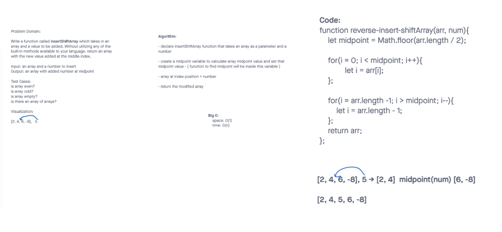

# Insert to Middle of an Array
Write a function called insertShiftArray which takes in an array and a value to be added. Without utilizing any of the built-in methods available to your language, return an array with the new value added at the middle index.

## Whiteboard Process

## Approach & Efficiency
We attempted to use two for loops - one tha would decrement through the given array until it gets to the calculated array midpoint. After adding the given number at the midpoint slot, a new for loop would continue to decrement through the array, setting each value from the original array at their new index positions.
