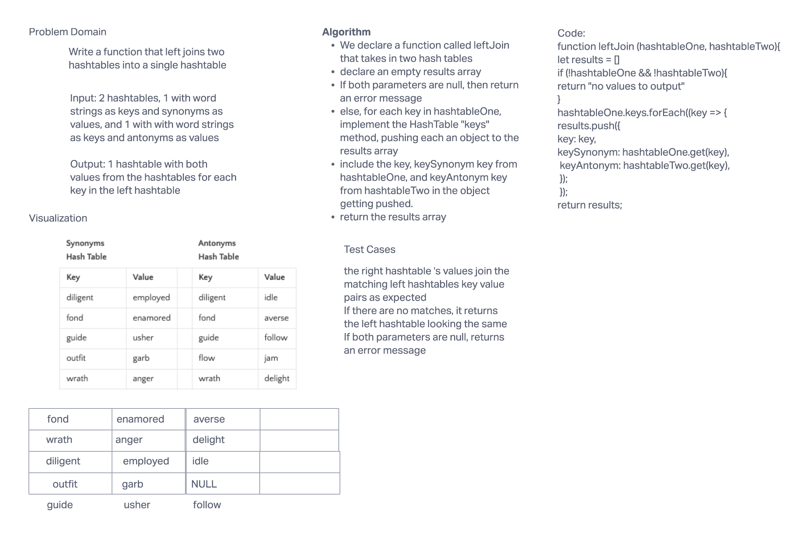

# Challenge Summary
Write a function called leftJoin that takes in two hash maps as parameters.

The first parameter is a hashmap that has word strings as keys, and a synonym of the key as values.
The second parameter is a hashmap that has word strings as keys, and antonyms of the key as values.

Return a single data structure that holds the results - the data structure you return is up to you.

## Whiteboard Process

## Approach & Efficiency
We call the keys() method with a foreach loop on the first hash map. For each key in hash map one, we push that key and the corresponding values from both hash maps (if they exist) into a returned results array.

## Solution
We declare a function tha takes in two hash tables, then we declare an empty results array.

We then use a forEach loop on hash map one's keys() method, pushing each key into our results array, along with the corresponding value from each hashmap.

We then return the results array.
