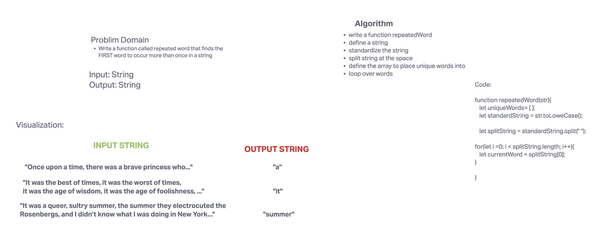

# Challenge Summary
Write a function called repeated word that finds the first word to occur more than once in a string.

## Whiteboard Process

## Approach & Efficiency
We looked to split the given string into an array of each word in the string, and then push each word into an empty array, checking to see if each word already exists in the array. If the word exists in the array, we return that word.

## Solution
We declare a repeatedWord function that takes in a string as an argument. Within this function we declare an empty array. From there we use the split method to create an array of all the words in the array.

From here we create a while loop that loops over each word in the newly split array and pushes that word into our empty array, checking if that word already exists in the array.
