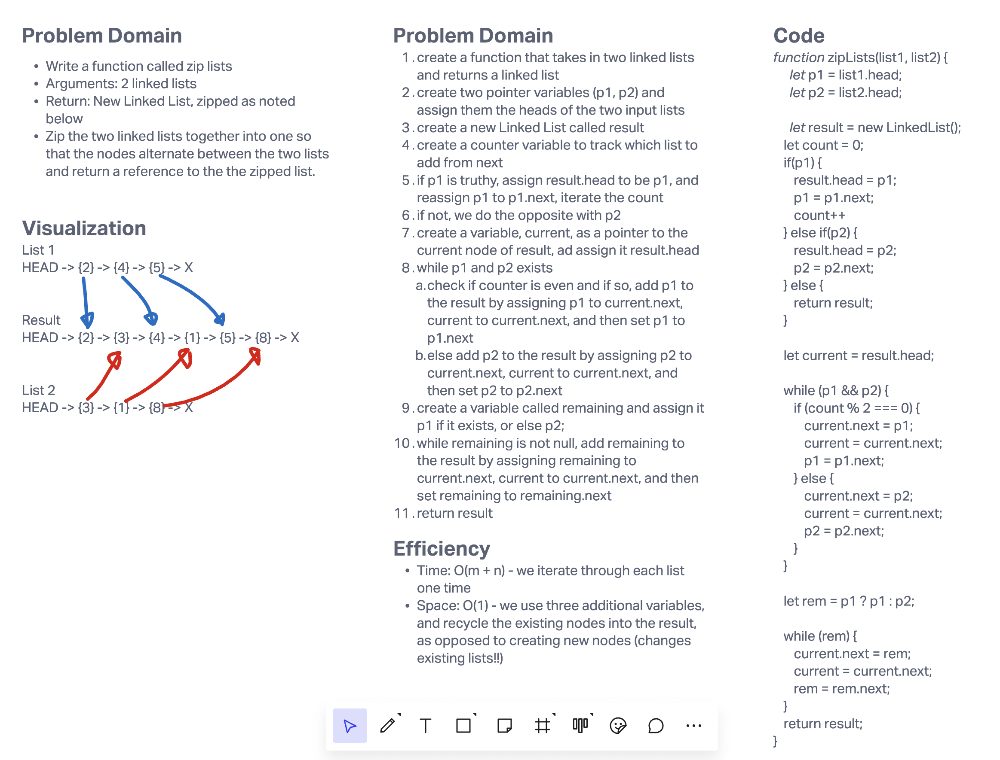

# Insert to Middle of an Array
Write a function called zip lists
Arguments: 2 linked lists
Return: New Linked List, zipped as noted below
Zip the two linked lists together into one so that the nodes alternatebetween the two lists and return a reference to the the zipped list.

## Whiteboard Process

