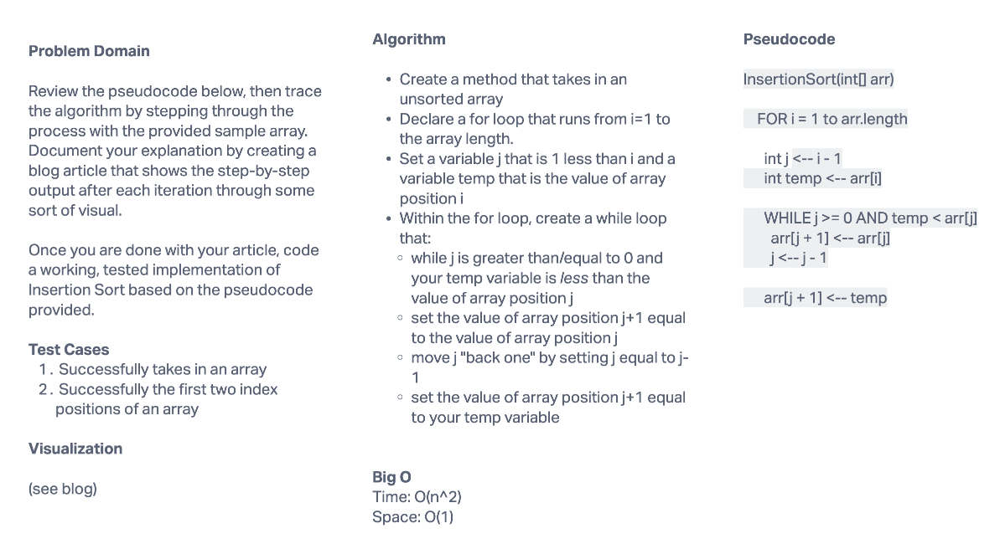

# Challenge Summary
Trace through an InsertionSort algorithm given a sample array.

## Whiteboard Process

## Approach & Efficiency
An InsertionSort algoritm works by working through an array from the beginning and comparing each element in the "non sorted" part of the array to elements in the "sorted" part of the array, and by moving elements into the "sorted" part of the array at the correct position.

## Solution
The InsertionSort algorithm compares each value in the array to its preceding value to determine if the values should be swapped based on ascendency. There is a for loop to work through the overall array, and a while loop that works through the "sorted" part of the array and moves any newly sorted values to the correct position within the "sorted" part of the array.
