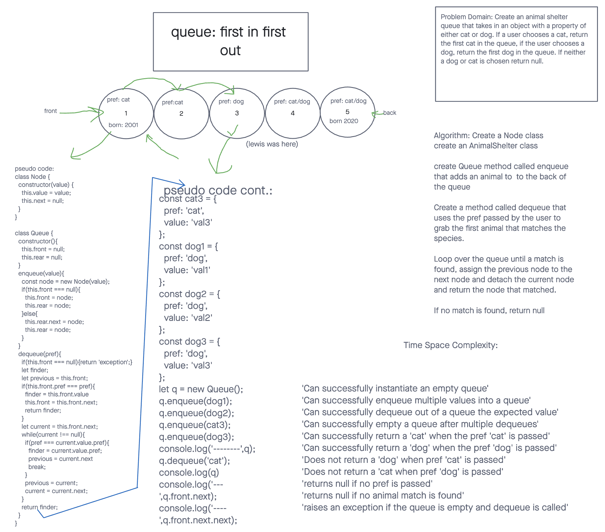

# Challenge
First-in, First out Animal Shelter.

## Whiteboard Process

## Approach & Efficiency
We create a Node and Queue class to start. From there we created an enqueue method to add animals to the back of a newly created queue, we then created a dequeue method that usees the users cat/dog preference to grab the first animal in the queue that mathes the preferred species.

To do this we loop over the queue until a match is found, assign the previous node to the next node and detach the current node and return the node that matched. If no match is found we return null or an error message.
