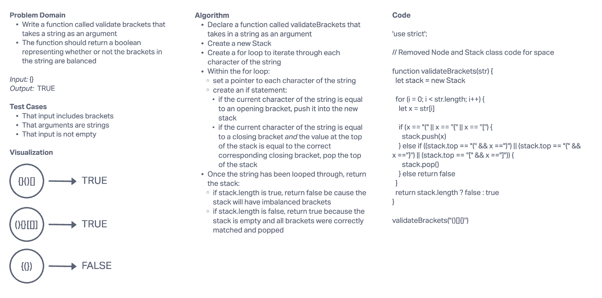

# Challenge
Multi-bracket Validation.

## Whiteboard Process

## Approach & Efficiency
I attempted to create a function that loops through each character of a given string and pushes any opening bracket characters into an array. Continuing, if the loop meets a closing bracket that matches the correct opening bracket at the top of the stack, it will pop that node from the stack.

Looping through the entire string, the loop would push in and then pop out all opening that brackets that had correctly placed closing brackets elsewhere in the string.

Once the string has been looped through, return the stack - if it is empty, we return true because the string's brackets are balanced and the stack is empty because all opening brackets were successfully popped out of the stack with corresponding closing brackets. If the stack is populated we return false becaue there is an opening bracket element in the stack that did not have a corresponding closing bracket in the string, meaning the string's brackets are imbalanced.
