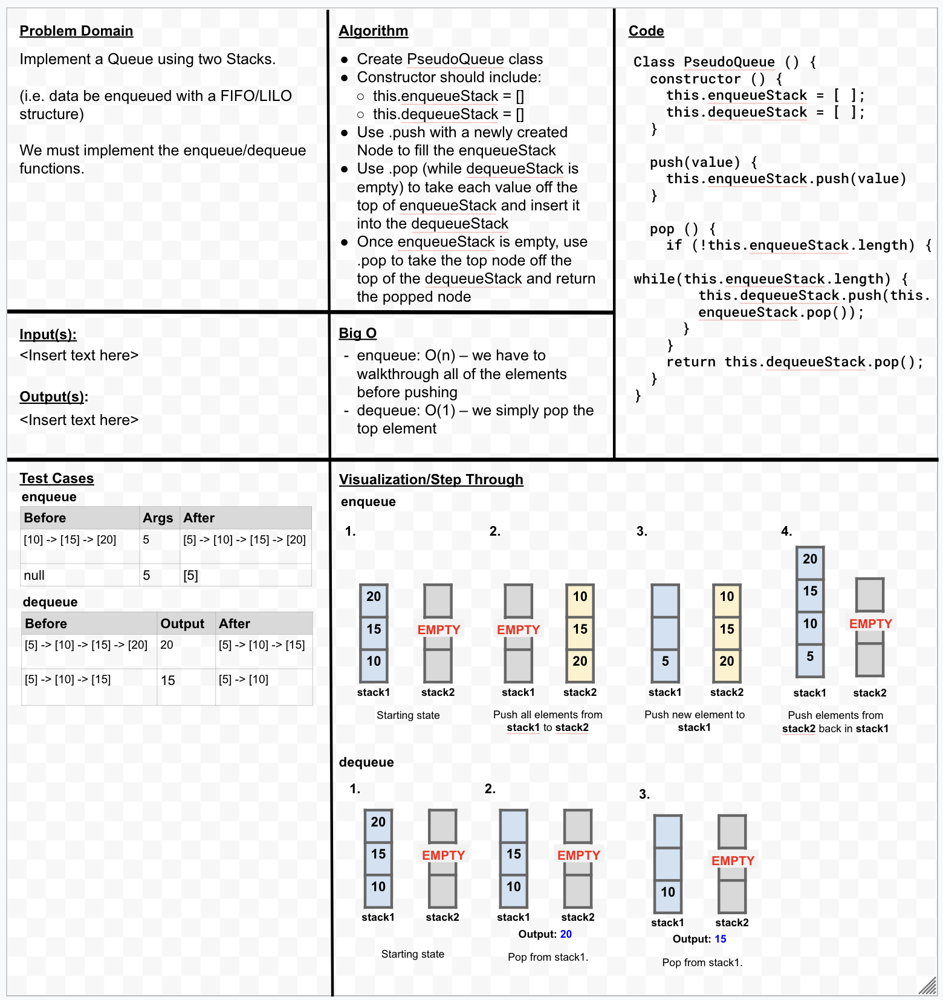

# Insert to Middle of an Array
Implement a Queue using two Stacks.

## Whiteboard Process

## Approach & Efficiency
We created two empty arrays (one for enqueue and one for dequeue) to simulate the process of creating a queue.

I will need to go through this to adjust the constructor so that our enqueue and dequeue methods instantiate new Stacks rather than pushing elements into an empty array.
