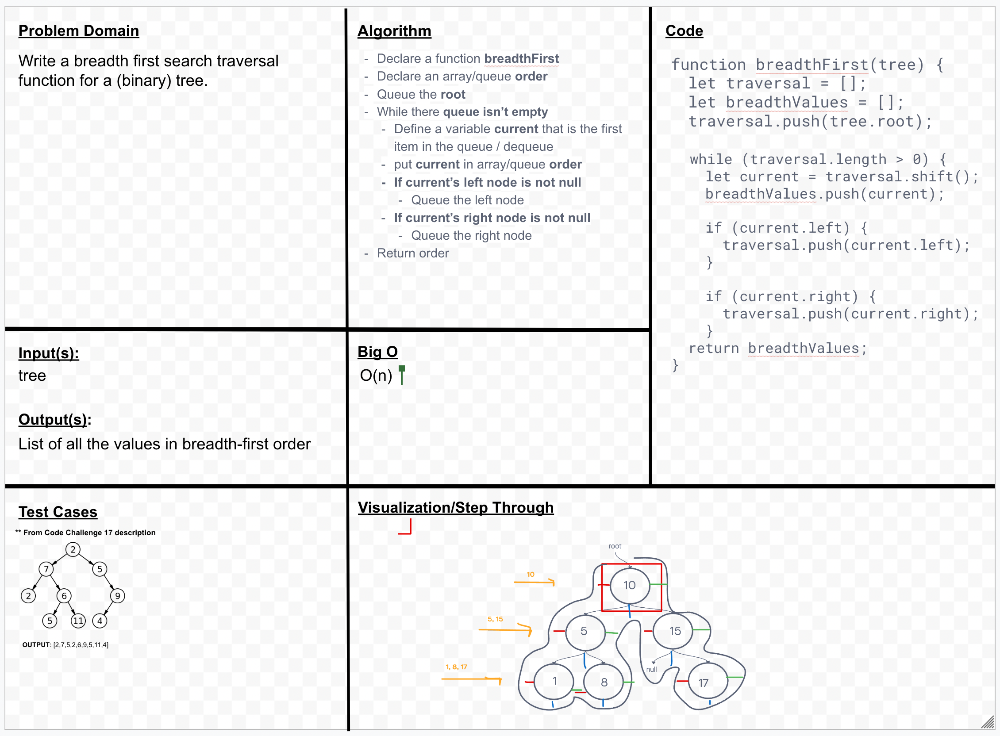

# Trees

Breadth-first Traversal.

## Challenge

Write a function called breadthFirst that takes in a tree as an argument and returns a list of values in the tree, in the order they were encountered.

## Whiteboard

