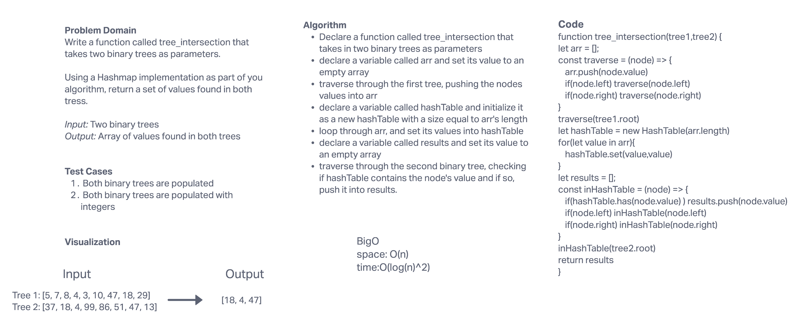

# Challenge Summary
Write a function called tree_intersection that takes two binary trees as parameters.

Using a Hashmap implementation as part of your algorithm, return a set of values found in both trees.

## Whiteboard Process

## Approach & Efficiency
Our approach was to create a hash table of the first tree and then feed the values of the second tree into the has() method of the hash table to determine if the second trees values are located within the first tree. If the has method returns true for a value, we push it into an empty array and return that array at the end of the function.

## Solution
Our function first creates an empty array that will hold our first tree's node values. From there we traverse the first tree, pushing its values into our empty array.

We then declare a hash table and initialize it with a size equal to the length of our array.

We then loop through this array and set its values into our hash table using the newly initialized hash table's set() method.

We then create an empty array that will hold our final results. We traverse the second tree and use the hash table's has() method to check if our tree 1 hash table containes any of tree 2's node values. If so we push that value into our results array.

We return our results array at the end of the function.
