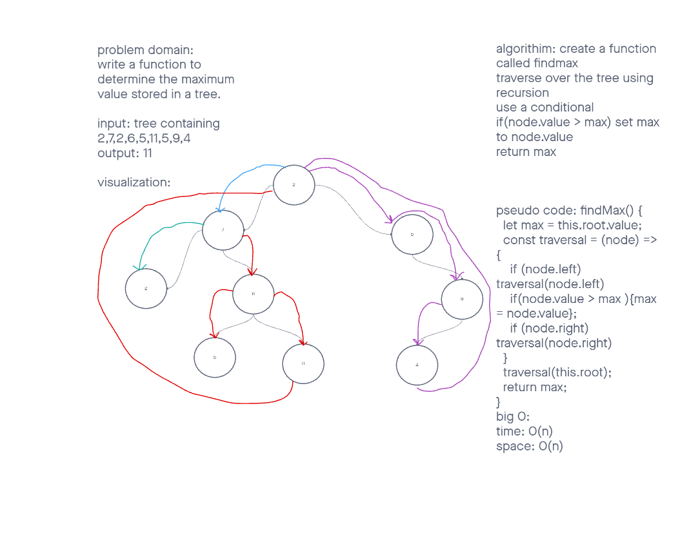

# Trees

Find the Maximum Value in a Binary Tree

## Challenge

Write the following method for the Binary Tree class

  - find maximum value
      - Arguments: none
      - Returns: number

Find the maximum value stored in the tree. You can assume that the values stored in the Binary Tree will be numeric.

## Whiteboard

## Approach & Efficiency

We are traversing the Binary Tree in order and comparing each Node to a max value that begins with the value of the root of the tree.

If the current node's value is greater than the current max variable's value, the max variable will be set to the value of that current node.

At the end of the traversal, we return the max variable.
