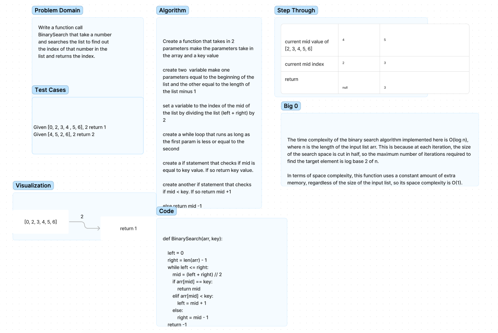

# Binary Search

Binary search in a sorted 1D array.

## Challenge

Write a function called BinarySearch which takes in 2 parameters: a sorted array and the search key. Without utilizing any of the built-in methods available to your language, return the index of the array’s element that is equal to the value of the search key, or -1 if the element is not in the array.

## Whiteboard

## Approach & Efficiency

We used the recursive binary search method by repeatedly finding the midpoint of an increasingly shrinking list. We created a variable to represent the front of our given list, and another variable set to the end of our list.

We then used a while loop that checks to the right and left of a newly calculated midpoint, checking to see if the midpoint is greater than or less than our given key.

## Partner

Darran Holmes
