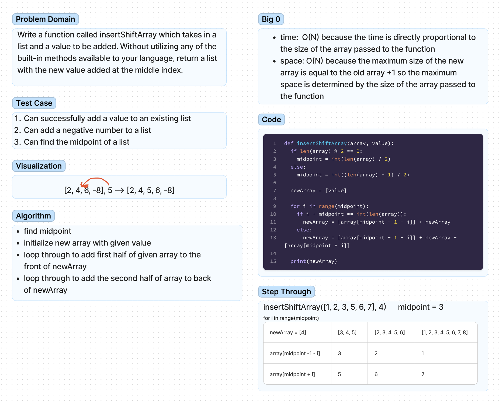

# Lists

Reverse a list.

## Challenge

Insert and shift an array in middle at index.

## Whiteboard

## Approach & Efficiency

We initialize a new list with our given value. We then find the midpoint of our given list.

We use a for loop to loop through the list, adding numbers to the left and right of the given value in our new array until the midpoint itself is reached, breaking the loop.
