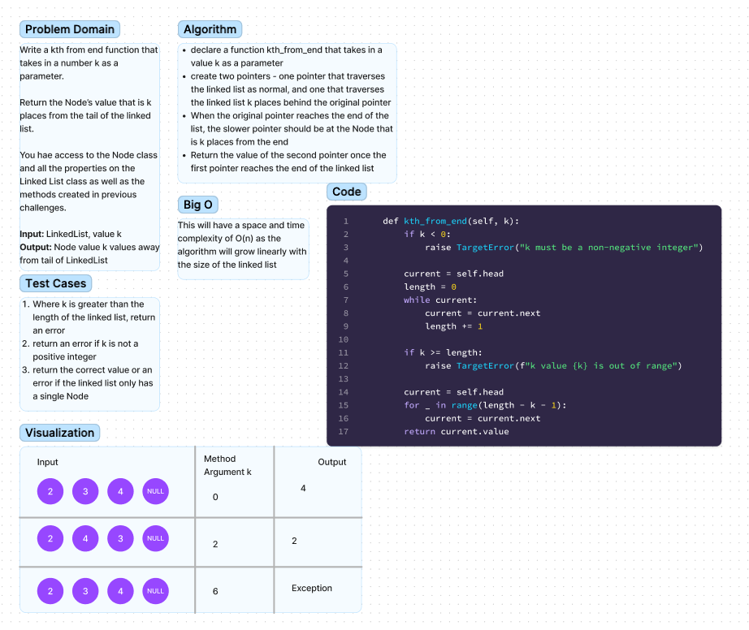

# K-th value from the end of a linked list.

Write the following method for the Linked List class:

kth from end
* argument: a number, k, as a parameter.
* Return the node’s value that is k places from the tail of the linked list.
* You have access to the Node class and all the properties on the Linked List class as well as the methods created in previous challenges.

## Whiteboard Process

## Approach & Efficiency
I used the two-pointer-method here with one pointer traversing the linked list as normal, and another pointer traversing the list k places behind the original pointer.
When the original pointer reaches the end of the linked list, the second pointer should be k places behind, and we return the value of that Node.

Space/Time Complexity: O(n)

## Solution
Code can be successfully run using the command python3 -m linked_list_kth.linked_list_kth, and tested using the command pytest tests/code_challenges/test_linked_list_kth.py

