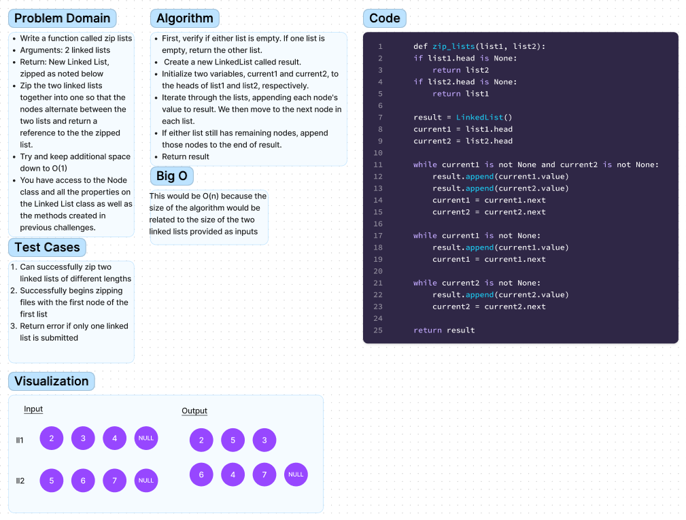

# Zip two linked lists

Write a function called zip lists
Arguments: 2 linked lists
Return: New Linked List, zipped as noted below
Zip the two linked lists together into one so that the nodes alternate between the two lists and return a reference to the the zipped list.
Try and keep additional space down to O(1)
You have access to the Node class and all the properties on the Linked List class as well as the methods created in previous challenges.

## Whiteboard Process

## Approach & Efficiency
I traverse each list in the order they are taken in, and then append one ned from each list with each traversal, being sure to switch back and for between each list.

Space/Time Complexity: O(n)

## Solution
Code can be successfully run using the command python3 -m linked_list_zip.linked_list_zip, and tested using the command pytest tests/code_challenges/test_linked_list_zip.py

