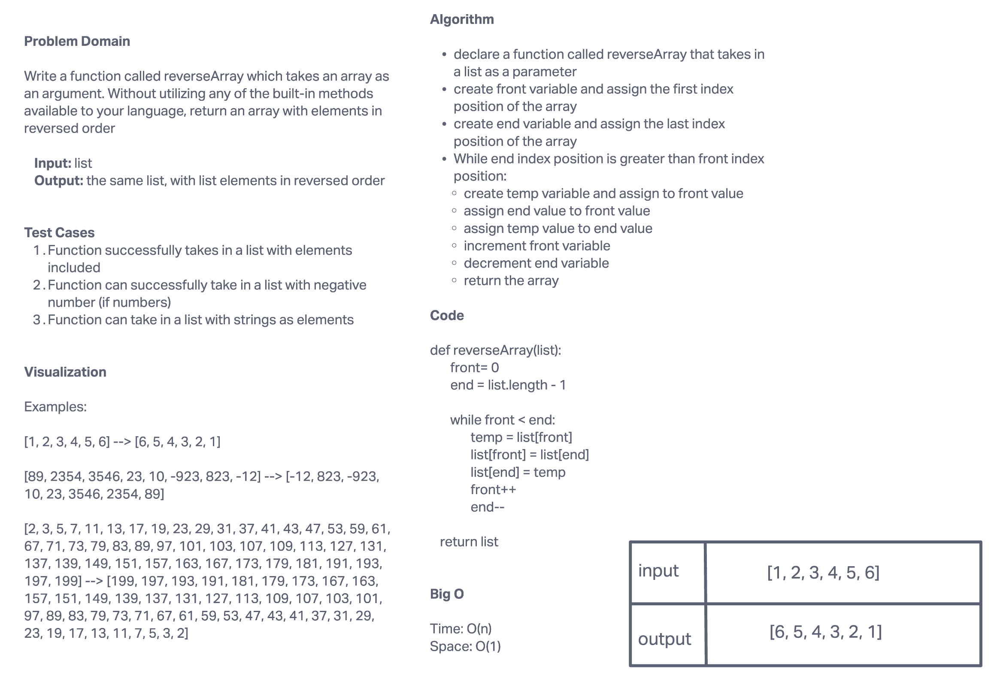

# Lists

Reverse a list.

## Challenge

Write a function called reverseArray which takes an array as an argument. Without utilizing any of the built-in methods available to your language, return an array with elements in reversed order.

## Whiteboard

## Approach & Efficiency

We solved this challenge by creating variables to hold the first and last values in the array, and a temporary variable that holds the first value in the array as we move through the array.

We created a while loop that stores the value of the front element in the array in a temp variable, sets the value of the end value of the array to the front value of the array, and sets the value of the temp variable to the end of the array.

From the here, our function increments the front variable and decrements the end variable while the end variable is greater than the front variable.
