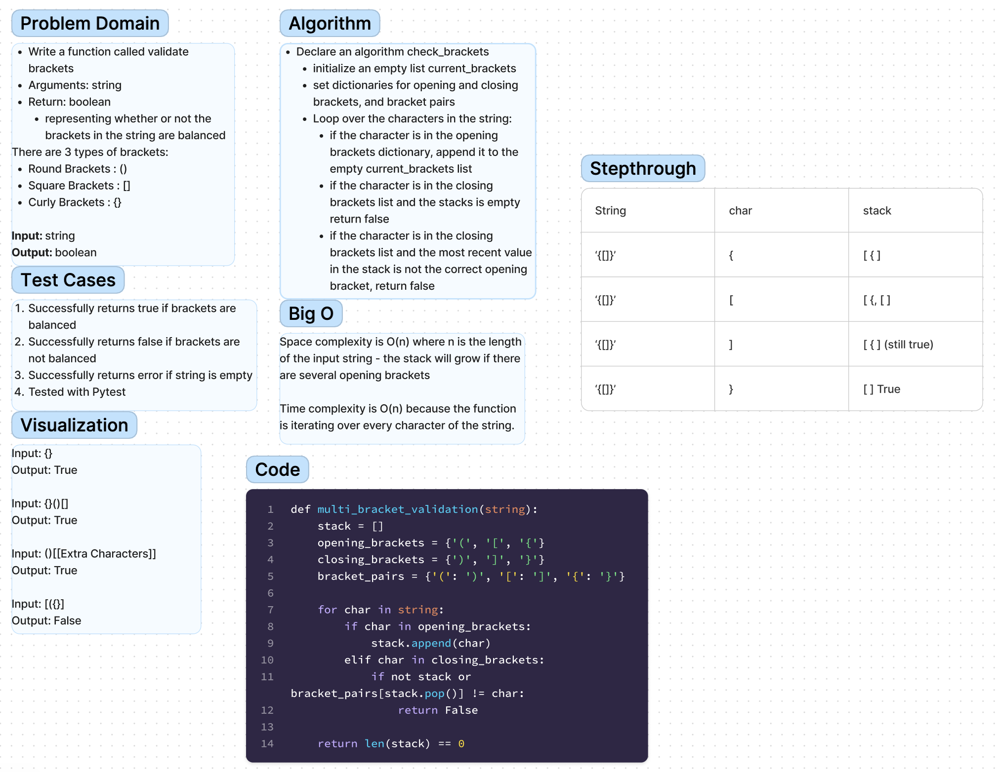

# Stack Queue Brackets
Feature Tasks
Write a function called validate brackets
Arguments: string
Return: boolean
representing whether or not the brackets in the string are balanced
There are 3 types of brackets:

Round Brackets : ()
Square Brackets : []
Curly Brackets : {}

## Whiteboard Process

## Approach & Efficiency
Declare an algorithm check_brackets
initialize an empty list current_brackets
set dictionaries for opening and closing brackets, and bracket pairs
Loop over the characters in the string:
if the character is in the opening brackets dictionary, append it to the empty current_brackets list
if the character is in the closing brackets list and the stacks is empty return false
if the character is in the closing brackets list and the most recent value in the stack is not the correct opening bracket, return false

## Solution
This code can be run using the command 'python3 code_challenges/stack_queue_brackets/stack_queue_brackets.py' and tested using the command 'pytest code_challenges/stack_queue_brackets'.
