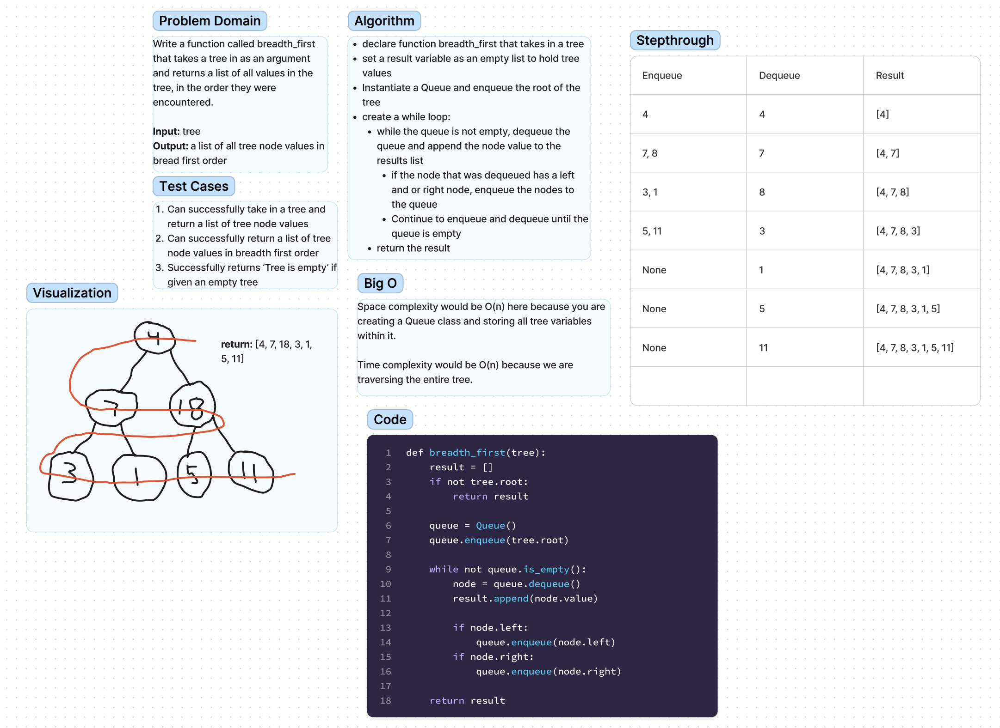

# Challenge Title
Write a function called breadth_first that takes a tree in as an argument and returns a list of all values in the tree, in the order they were encountered.

## Whiteboard Process

## Approach & Efficiency
The breadth first traversal traverses a tree from top to bottom, left to right using a Queue.

The tree root is enqueued to the Queue in a while loop and then dequeued, storing its value in a list variable.

Any left and right nodes of the tree are enqueued in to the queue, and subsequently dequeued for their values and nodes.

This is repeated until the Queue is empty and the list variable is returned.

## Solution
This code can be run using the command 'python3 code_challenges/tree_breadth_first/tree_breadth_first.py' and tested using the command 'pytest code_challenges/tree_breadth_first'.
