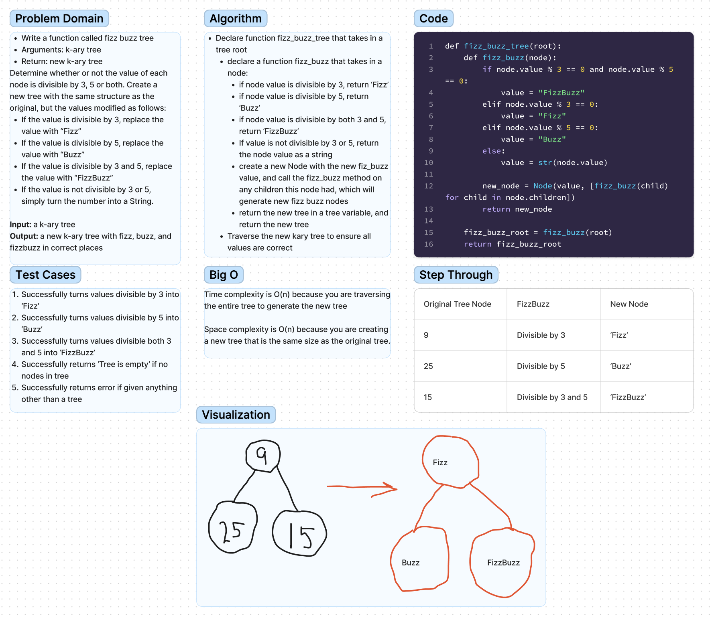

# Tree Fizz Buzz
Feature Tasks
Write a function called fizz buzz tree
Arguments: k-ary tree
Return: new k-ary tree
Determine whether or not the value of each node is divisible by 3, 5 or both. Create a new tree with the same structure as the original, but the values modified as follows:

If the value is divisible by 3, replace the value with “Fizz”
If the value is divisible by 5, replace the value with “Buzz”
If the value is divisible by 3 and 5, replace the value with “FizzBuzz”
If the value is not divisible by 3 or 5, simply turn the number into a String.

## Whiteboard Process

## Approach & Efficiency
For this we set the fizz buzz division parameters within the first portion of our method to generate the new node values for our new kary tree.

From there we recursively call the function on each of the nodes children to generate new children for that node, and all subsequent nodes.

Once the new kary tree is created, it is necessary to traverse this new tree to see that all values have been converted correctly.

## Solution
This code can be run using the command 'python3 code_challenges/tree_fizz_buzz/tree_fizz_buzz.py' and tested using the command 'pytest code_challenges/tree_fizz_buzz'.
