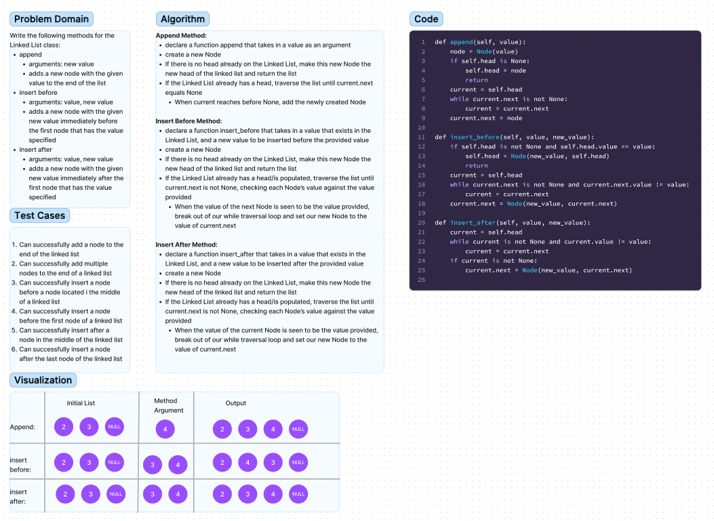

# Linked List Implementation

Extend a Linked List to allow various insertion methods.

Write the following methods for the Linked List class:

append
* arguments: new value
* adds a new node with the given value to the end of the list

insert before
* arguments: value, new value
* adds a new node with the given new value immediately before the first node that has the value specified

insert after
* arguments: value, new value
* adds a new node with the given new value immediately after the first node that has the value specified

## Whiteboard Process

## Approach & Efficiency
Append Method: Traverse the Linked List until current.next is found to be Null, at which point set the value of current.next to our provided insertion value.
Insert Before Method: Traverse the Linked List until current.next is found to be our provided existing value, at which point set the value of current.next to our provided insertion value.
Insert After Method: Traverse the Linked List until current.value is found to be our provided existing value, at which point set the value of current.next to our provided insertion value.

Space/Time Complexity: O(n)

## Solution
Code can be successfully run using the command python3 -m linked_list_insertions.linked_list_insertions, and tested using the command pytest tests/code_challenges/test_linked_list_insertions.py

